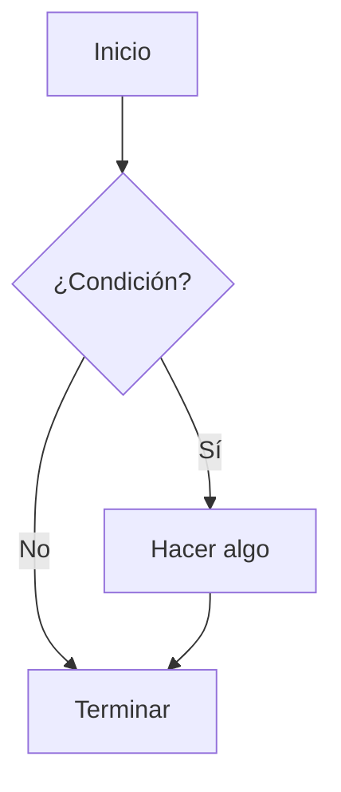

Para editar el aspecto debes tener alguna familiaridad con [NextJS](https://nextjs.org/). Se trata de un framework web construido sobre [React](https://es.react.dev/). En **MBlog** usamos también módulos para facilitar la creación de gráficos ([Mermaid](https://mermaid.js.org/)), gráficos estadísticos ([Recharts](https://recharts.org/)) y textos científicos ([KaTeX](https://katex.org/)).

Hemos puesto bastante esfuerzo en que se pueda escribir prácticamente todo el contenido en [Markdown](https://commonmark.org/help/). Markdown es texto puro, con alguna sintaxis especial para expresar el aspecto. Por tanto, todo el sitio web puedes editarlo si lo deseas directamente desde el repositorio GitHub, usando la interfaz web de GitHub y sin ni siquiera descargar el repositorio.  Esto implica que incluso sin instalar nada, tenemos control de versiones de todos los cambios, lo que facilita enormemente encontrar y solucionar problemas en el sitio web.

Para usos avanzados, el contenido puede también escribirse parcialmente en JSX, el lenguaje que utiliza React para definir los componentes. Eso implica que se pueden incluir todo tipo de componentes React en tu sitio.  De todas formas, recuerda que es un sitio completamente estático. En principio todo tiene que estar definido en tiempo de compilación y, si no es así, tendrás que depender de servicios externos para implementar APIs que proporcionen los datos dinámicos.

## Comenzar una nueva web

* Haz un *fork* del [repositorio de MBlog](https://github.com/uclm-mantis/blog).
* Edita el archivo de configuración `config.ts` en la carpeta raiz. Cambia `SITE_NAME` a lo que tú consideres conveniente. Volveremos a este archivo cuando quieras añadir destacados en alguna sección.
* En los ajustes de tu repositorio pincha en el menú lateral **Pages**. Debería estar configurado con estos parámetros:

#### Build and deployment

| Source               | Branch     | Folder |
|----------------------|------------|--------|
| Deploy from a branch | gh-pages   |   /    |

Ya está, eso es todo. Ya tienes una web editable directamente desde GitHub.  Al hacer el *fork* estamos definiendo implícitamente la ruta que va a tener el sitio según las reglas de GitHub Pages.  Por ejemplo, si el usuario de GitHub `Fenomeno` hace el *fork* en un repositorio privado llamado `fenolab`, entonces el sitio web estará disponible en `https://fenomeno.github.io/fenolab`.  Si el *fork* se realiza en un repositorio llamado `fenomeno.github.io` entonces el sitio estará disponible en `https://fenomeno.github.io`.

## Estructura del sitio

Los aspectos interesantes de la estructura se muestran a continuación.

  <FileTreeViewer fileTree={[
    { name: '/', children: [
      { name: 'components/' },
      { name: 'pages/' },
      { name: 'content/' },
      { name: 'public/' },
      { name: 'config.ts', type: 'file' },
    ]}
  ]} />

* En `config.ts` se puede configurar el nombre del sitio y la forma en la que se renderizan las secciones del sitio.
* En `content/` está todo el contenido del sitio. Para un usuario básico no es necesario editar fuera de esta carpeta.
* En `public/` están todos los archivos no editables: imágenes, documentos, videos, presentaciones, etc.

Todo lo que está en `/public` está automáticamente disponible en el sitio final sin la ruta `public`.  Así, por ejemplo, el archivo `public/img/robotics.png` estará disponibl en el sitio final en la ruta `img/robotics.png` relativo a la URL base del sitio.

## Editar contenido en Markdown

Este es un ejemplo de matemáticas en línea: $E = mc^2$.

Aquí tienes una fórmula en bloque:

$$
\int_a^b f(x) dx = F(b) - F(a)
$$

Y ahora un gráfico Mermaid

Y ahora alguna gráfica más

<ResponsiveContainer width={700} height="80%">
 <ChartComponent
  type="line"
  data={[
    { name: 'Enero', uv: 4000, pv: 2400 },
    { name: 'Febrero', uv: 3000, pv: 1398 },
    { name: 'Marzo', uv: 2000, pv: 9800 },
  ]}
  config={[
    { dataKey: 'uv', color: '#8884d8' },
    { dataKey: 'pv', color: '#82ca9d' },
  ]}
/>
</ResponsiveContainer>

Y un gráfico de barras:

<ResponsiveContainer width={700} height="80%">
<ChartComponent
  type="bar"
  data={[
    { name: 'Lunes', visitas: 30 },
    { name: 'Martes', visitas: 45 },
    { name: 'Miércoles', visitas: 50 },
  ]}
  config={[
    { dataKey: 'visitas', color: '#8884d8' },
  ]}
/>
</ResponsiveContainer>