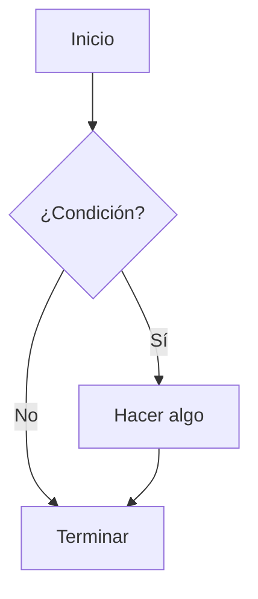

MBlog está construido con [NextJS](https://nextjs.org/). Para editar contenido no tienes que saber gran cosa sobre esto, pero al menos deberás acostumbrarte a que haya más archivos que los que tú editas. *NextJS* es un framework web que a su vez se basa en [React](https://es.react.dev/), un reconocido framework para desarrollar aplicaciones web basadas en componentes. No tienes que saber nada de *React* para usar *MBlog*, pero tienes a tu disposición toda su potencia si alguna vez necesitas algo avanzado, o simplemente diferente.

En **MBlog** usamos también una serie de paquetes para facilitar la creación de documentos con contenido rico:

* [Mermaid](https://mermaid.js.org/) permite hacer dibujos de diagramas de flujo, cronogramas, diagramas de bloques, y muchos otros, utilizando un lenguaje textual muy sencillo. ¿Prefieres usar Visio, Inkscape, DIA o similares? Por supuesto que puedes, pero te costará mucho más analizar diferencias, hacer modificaciones sencillas, automatizar gráficos repetitivos, etc.  La integración con Markdown es directa, dentro de bloques de código.

* [Recharts](https://org/) permite hacer todo tipo de gráficos estadísticos avanzados. Examina la documentación oficial para ver ejemplos de los diferentes tipos de gráficos.

* [KaTeX](https://katex.org/). Es una implementación de un subconjunto significativo de las fórmulas de LaTeX. Lo suficiente para poder editar textos científicos de cierta complejidad.  Está muy bien integrado con Markdown, basta introducir las expresiones entre signos $ (para expresiones en línea) o bien entre doble signo $$ (para fórmulas destacadas).

Hemos puesto bastante esfuerzo en que se pueda escribir prácticamente todo el contenido en [Markdown](https://commonmark.org/help/). Markdown es texto puro, con alguna sintaxis especial para expresar el aspecto. Por tanto, todo el sitio web puedes editarlo si lo deseas directamente desde el repositorio GitHub, usando la interfaz web de GitHub y sin ni siquiera descargar el repositorio.  Esto implica que incluso sin instalar nada, tenemos control de versiones de todos los cambios, lo que facilita enormemente encontrar y solucionar problemas en el sitio web.

Para usos avanzados, el contenido puede también escribirse parcialmente en JSX, el lenguaje que utiliza React para definir los componentes. Eso implica que se pueden incluir todo tipo de componentes React en tu sitio.  De todas formas, recuerda que es un sitio completamente estático. En principio todo tiene que estar definido en tiempo de compilación y, si no es así, tendrás que depender de servicios externos para implementar APIs que proporcionen los datos dinámicos. Esto implica que no puedes añadir sentencias en JavaScript, solo expresiones.

## Comenzar una nueva web

* Haz un *fork* del [repositorio de MBlog](https://github.com/uclm-mantis/blog).
* Edita el archivo de configuración `config.ts` en la carpeta raiz. Cambia `SITE_NAME` a lo que tú consideres conveniente. Volveremos a este archivo cuando quieras añadir destacados en alguna sección.
* En los ajustes de tu repositorio pincha en el menú lateral **Pages**. Debería estar configurado con **Source: GitHub Actions**. No es necesario añadir un workflow porque ya lo tiene el repositorio (ver `.github/workflows/deploy.yml`).

Ya está, eso es todo. Ya tienes una web editable directamente desde GitHub.  Al hacer el *fork* estamos definiendo implícitamente la ruta que va a tener el sitio según las reglas de GitHub Pages.  Por ejemplo, si el usuario de GitHub `Fenomeno` hace el *fork* en un repositorio privado llamado `fenolab`, entonces el sitio web estará disponible en `https://fenomeno.github.io/fenolab`.  Si el *fork* se realiza en un repositorio llamado `fenomeno.github.io` entonces el sitio estará disponible en `https://fenomeno.github.io`.

## Estructura del sitio

Los aspectos interesantes de la estructura se muestran a continuación.

<div className="flex w-3/4 mx-auto border p-2 rounded-lg shadow">
  <FileTreeViewer fileTree={[
    { name: '/', type: 'directory', children: [
      { name: 'components/', type: 'directory', },
      { name: 'pages/',      type: 'directory', },
      { name: 'content/',    type: 'directory', description: 'Contenido editable del sitio' },
      { name: 'public/',     type: 'directory', description: 'Archivos gráficos y descargables' },
      { name: 'config.ts',   type: 'file',      description: 'Archivo de configuración de MBlog' },
    ]}
  ]} />
</div>

* En `config.ts` se puede configurar el nombre del sitio y la forma en la que se renderizan las secciones del sitio.
* En `content/` está todo el contenido del sitio. Para un usuario básico no es necesario editar fuera de esta carpeta.
* En `public/` están todos los archivos no editables: imágenes, documentos, videos, presentaciones, etc.

Todo lo que está en `/public` está automáticamente disponible en el sitio final sin la ruta `public`.  Así, por ejemplo, el archivo `public/img/robotics.png` estará disponibl en el sitio final en la ruta `img/robotics.png` relativo a la URL base del sitio.

## Editar contenido en Markdown

Antes de nada, un poco de teoría.  Un archivo Markdown tiene dos partes, una cabecera y un cuerpo. Veamos un ejemplo:

```

```

Este es un ejemplo de matemáticas en línea: $E = mc^2$.

Aquí tienes una fórmula en bloque:

$$
\int_a^b f(x) dx = F(b) - F(a)
$$

Y ahora un gráfico Mermaid

<div className="flex justify-center">

</div>

Y ahora alguna gráfica más

<ResponsiveContainer width={700} height="80%">
 <ChartComponent
  type="line"
  data={[
    { name: 'Enero', uv: 4000, pv: 2400 },
    { name: 'Febrero', uv: 3000, pv: 1398 },
    { name: 'Marzo', uv: 2000, pv: 9800 },
  ]}
  config={[
    { dataKey: 'uv', color: '#8884d8' },
    { dataKey: 'pv', color: '#82ca9d' },
  ]}
/>
</ResponsiveContainer>


Y un gráfico de barras:

<ResponsiveContainer width={700} height="80%">
<ChartComponent
  type="bar"
  data={[
    { name: 'Lunes', visitas: 30 },
    { name: 'Martes', visitas: 45 },
    { name: 'Miércoles', visitas: 50 },
  ]}
  config={[
    { dataKey: 'visitas', color: '#8884d8' },
  ]}
/>
</ResponsiveContainer>