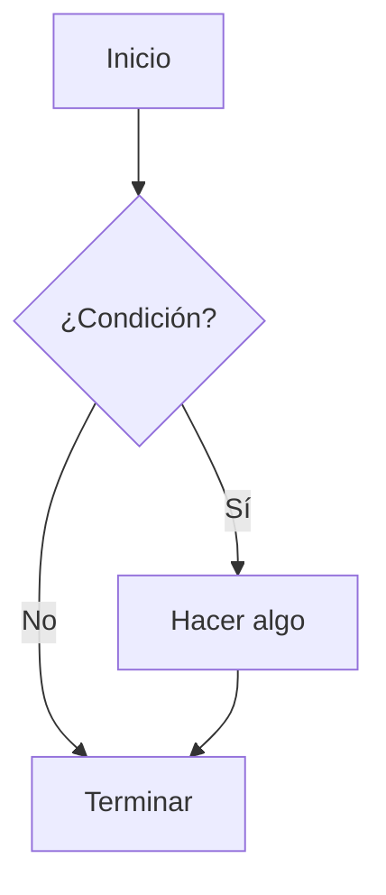
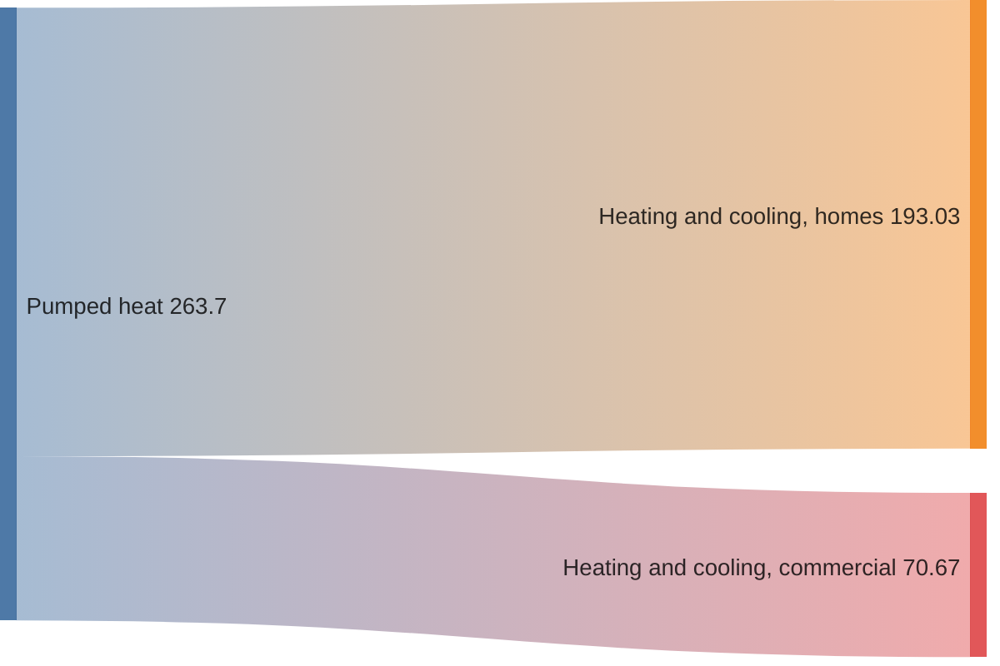
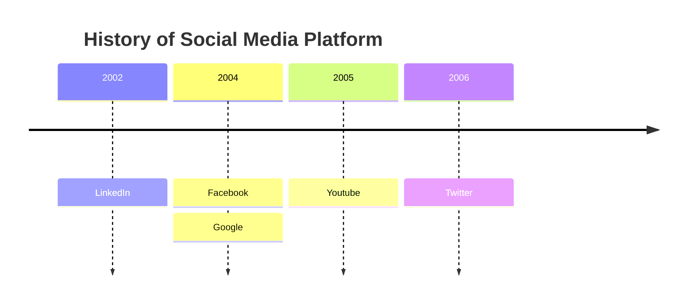

MBlog está construido con [NextJS](https://nextjs.org/). Para editar contenido no tienes que saber gran cosa sobre esto, pero al menos deberás acostumbrarte a que haya más archivos que los que tú editas. *NextJS* es un framework web que a su vez se basa en [React](https://es.react.dev/), un reconocido framework para desarrollar aplicaciones web basadas en componentes. No tienes que saber nada de *React* para usar *MBlog*, pero tienes a tu disposición toda su potencia si alguna vez necesitas algo avanzado, o simplemente diferente.

En **MBlog** usamos también una serie de paquetes para facilitar la creación de documentos con contenido rico:

* [Mermaid](https://mermaid.js.org/) permite hacer dibujos de diagramas de flujo, cronogramas, diagramas de bloques, y muchos otros, utilizando un lenguaje textual muy sencillo. ¿Prefieres usar Visio, Inkscape, DIA o similares? Por supuesto que puedes, pero te costará mucho más analizar diferencias, hacer modificaciones sencillas, automatizar gráficos repetitivos, etc.  La integración con Markdown es directa, dentro de bloques de código.

* [Recharts](https://org/) permite hacer todo tipo de gráficos estadísticos avanzados. Examina la documentación oficial para ver ejemplos de los diferentes tipos de gráficos.

* [KaTeX](https://katex.org/). Es una implementación de un subconjunto significativo de las fórmulas de LaTeX. Lo suficiente para poder editar textos científicos de cierta complejidad.  Está muy bien integrado con Markdown, basta introducir las expresiones entre signos $ (para expresiones en línea) o bien entre doble signo $$ (para fórmulas destacadas).

Hemos puesto bastante esfuerzo en que se pueda escribir prácticamente todo el contenido en [Markdown](https://commonmark.org/help/). Markdown es texto puro, con alguna sintaxis especial para expresar el aspecto. Por tanto, todo el sitio web puedes editarlo si lo deseas directamente desde el repositorio GitHub, usando la interfaz web de GitHub y sin ni siquiera descargar el repositorio.  Esto implica que incluso sin instalar nada, tenemos control de versiones de todos los cambios, lo que facilita enormemente encontrar y solucionar problemas en el sitio web.

Para usos avanzados, el contenido puede también escribirse parcialmente en JSX, el lenguaje que utiliza React para definir los componentes. Eso implica que se pueden incluir todo tipo de componentes React en tu sitio.  De todas formas, recuerda que es un sitio completamente estático. En principio todo tiene que estar definido en tiempo de compilación y, si no es así, tendrás que depender de servicios externos para implementar APIs que proporcionen los datos dinámicos. Esto implica que no puedes añadir sentencias en JavaScript, solo expresiones.

## Comenzar una nueva web

* Haz un *fork* del [repositorio de MBlog](https://github.com/uclm-mantis/blog).
* Edita el archivo de configuración `config.ts` en la carpeta raiz. Cambia `SITE_NAME` a lo que tú consideres conveniente. Volveremos a este archivo cuando quieras añadir destacados en alguna sección.
* En los ajustes de tu repositorio pincha en el menú lateral **Pages**. Debería estar configurado con **Source: GitHub Actions**. No es necesario añadir un workflow porque ya lo tiene el repositorio (ver `.github/workflows/deploy.yml`).

Ya está, eso es todo. Ya tienes una web editable directamente desde GitHub.  Al hacer el *fork* estamos definiendo implícitamente la ruta que va a tener el sitio según las reglas de GitHub Pages.  Por ejemplo, si el usuario de GitHub `Fenomeno` hace el *fork* en un repositorio privado llamado `fenolab`, entonces el sitio web estará disponible en `https://fenomeno.github.io/fenolab`.  Si el *fork* se realiza en un repositorio llamado `fenomeno.github.io` entonces el sitio estará disponible en `https://fenomeno.github.io`.

## Estructura del sitio

Los aspectos interesantes de la estructura se muestran a continuación.

<div className="flex w-3/4 mx-auto border p-2 rounded-lg shadow">
  <FileTreeViewer fileTree={[
    { name: '/', type: 'directory', children: [
      { name: 'components/', type: 'directory', },
      { name: 'pages/',      type: 'directory', },
      { name: 'content/',    type: 'directory', description: 'Contenido editable del sitio' },
      { name: 'public/',     type: 'directory', description: 'Archivos gráficos y descargables' },
      { name: 'config.ts',   type: 'file',      description: 'Archivo de configuración de MBlog' },
    ]}
  ]} />
</div>

* En `config.ts` se puede configurar el nombre del sitio y la forma en la que se renderizan las secciones del sitio.
* En `content/` está todo el contenido del sitio. Para un usuario básico no es necesario editar fuera de esta carpeta.
* En `public/` están todos los archivos no editables: imágenes, documentos, videos, presentaciones, etc.

Todo lo que está en `/public` está automáticamente disponible en el sitio final sin la ruta `public`.  Así, por ejemplo, el archivo `public/img/robotics.png` estará disponibl en el sitio final en la ruta `img/robotics.png` relativo a la URL base del sitio.

## Editar contenido en Markdown

Antes de nada, un poco de teoría.  Un archivo Markdown tiene dos partes, una cabecera y un cuerpo. Veamos por ejemplo un archivo `content/members/tim.md`:

```
---
title: "Tim Burton"
givenName: Tim
sn: Burton
email: "tim.burton@hollywood.us"
github: TimBurton
position: Movie Maker
section: Team
type: member
---

Timothy Walter Burton[a] (born August 25, 1958) is an American film director, producer, screenwriter, and animator. Known for popularizing Goth culture in the American film industry, Burton is famous for his gothic horror and fantasy films. He has received numerous accolades including an Emmy Award as well as nominations for two Academy Awards, a Golden Globe Award and three BAFTA Awards. He was honored with the Venice International Film Festival's Golden Lion for Lifetime Achievement in 2007 and was given the Order of the Arts and Letters by Culture Minister of France in 2010.
```

La cabecera está incluida entre dos líneas con `---`, el resto es el cuerpo.  Los atributos que puede tener un determinado tipo de contenido están definidos en `config.ts`. Puedes cambiarlos, o añadir nuevos tipos. Veamos por ejemplo cómo está definido el tipo para los `member`:

```
export interface TeamMember extends ContentBase {
    type: "member";
    position?: string;
    givenName?: string;
    sn?: string;
    image?: string;
    phone?: string;
    email?: string;
    github?: string;
    orcid?: string;
}
```

Ese `type: "member"` lo delata, es el tipo que buscamos. Tiene un montón de campos pero todos con un signo de interrogación. Eso significa que son todos opcionales. Pero fíjate en la línea superior: `extends ContentBase`. Eso significa que además tiene todos los campos de `ContentBase`:

```
export interface ContentBase {
    id: string;
    title: string;
    section: string;
    slug: string;
    files?: string[];
    order?: number;

    content?: string;
    contentHtml?: any;
    fileTree?: any;
}
```

Todos los campos de `ContentBase` son también campos de los archivos de tipo `member`. Y vemos que hay varios obligatorios.  Ya que estos son comunes a todo el contenido vamos a explicarlos con más detalle.

Atributo | Descripción
--- | ---
title | Es el título del contenido. Se utiliza para poder generar listas de contenido, pero no tiene un significado especial.  Es decir, tú decides para qué lo quieres. En los documentos de tipo `member` se usa como nombre completo, pero hay tambien un `givenName` y un `sn` que podrían cumplir esa misión. 
section | Es el nombre de la sección del sitio en la que se asocia este contenido. Las secciones aparecen en el menú superior de la página. Organiza las secciones como lo desees.
files | Algunos contenidos pueden tener una serie de archivos asociados. Se pueden poner en este atributo. Si se pone una carpeta incluirá todo su contenido. Más adelante te explicaremos cómo se usa.
order | Es un número que indica el orden deseado. En algunos contenidos podemos dar un orden por una fecha, orden alfabético de algún atributo, o por otro criterio, pero otros contenidos no tienen otro criterio que el deseo del usuario. Usa `order` con un número si quieres ordenar según tu propio criterio.
slug | Es la ruta del archivo relativa a la carpeta `content` y sin extensión. Se rellena internamente y se usa internamente, así que no hay que añadirlo. 
id | El `id` es un identificator único para ese contenido. Si no se rellena, el sistema generará uno a partir de la ruta del archivo. Por tanto, no lo añadas.
content | Este atributo se rellena automáticamente con el cuerpo del documento, lo que va después de la cabecera. No lo añadas.
contentHtml| Este atributo se rellena automáticamente con el resultado de renderizar en una página web el contenido. No lo añadas.
fileTree | Este atributo se rellena con la jerarquía completa de archivos asociados a este contenido. Se genera automáticamente a partir del contenido de `files`. Por tanto, no lo añadas.

Supongamos que queremos añadir campos en los documentos de tipo `member` con el usuario de Facebook o Instagram. Basta editar `config.ts` y añadirlos así:

```
export interface TeamMember extends ContentBase {
    type: "member";
    position?: string;
    givenName?: string;
    sn?: string;
    image?: string;
    phone?: string;
    email?: string;
    github?: string;
    orcid?: string;
    facebook?: string;
    instagram?: string;
}
```

¿Y ya está? Bueno, con esto ya puedes rellenar los datos en el documento Markdown.  Por ejemplo:

```
---
...
facebook: TimBurton
instagram: TimBurton
---

...
```

El contenido está, pero si navegas a la sección `Team` no verás los datos nuevos. ¿Por qué?  Porque se necesita indicar cómo queremos mostrarlos, el aspecto de esos datos.  Para eso están los *renderers*, componentes que presentan el contenido. Eso lo explicaremos en otro mensaje.  De momento asumiremos que disponemos de componentes para mostrar todos los datos.

Vamos a añadir una nueva imagen para *Tim*. Descargamos, por ejemplo, la foto de perfil de [su Facebook](https://www.facebook.com/TimBurton/) y la guardamos con la ruta `public/team/tim.jpg`.  Ahora podemos añadir:

```
---
...
image: "{{basePath}}/team/tim.jpg"
---

...
```

Hay dos cosas importantes en este ejemplo. Primero, hemos añadido ese <code><span>{'{{'}</span>basePath<span>{'}}'}</span></code> a la ruta de la imagen. Eso permite que el sitio web pueda tener cualquier prefijo, y los datos se almacenarán a partir de ese prefijo.  Por ejemplo, en la sección anterior vimos que el sitio podría estar en algo como `https://fenomeno.github.io/fenolab` o bien directamente en `https://fenomeno.github.io/`. En el primer caso `{{basePath}}` se expandirá como `/fenolab`, mientras que en el segundo caso se expandirá como la cadena vacía.

La segunda cosa importante de este ejemplo es que usamos comillas para delimitar la ruta. Esto es necesario porque de otro modo los caracteres `{` se interpretarían como algo especial, algo escrito en JavaScript, que no es sintácticamente correcto y por lo tanto daría un error a la hora de desplegarlo.  Si no hay ambigüedad, no hace falta poner comillas. Pero si hay posibilidad de interpretarlo de otra forma, no hay más remedio que ponerlas. En caso de duda ponlas.

El cuerpo del mensaje utiliza una serie de símbolos para controlar el aspecto. Familiarízate con un tutorial de Markdown como [este](https://mdxjs.com/guides/gfm/). En MBlog utilizamos [MDX](https://mdxjs.com/) que es una implementación de Markdown muy peculiar. Se pueden añadir características por medio de *plugins* y nosotros solo hemos añadido unos cuantos [^1]. 

[^1] Si te falta alguno edita la función `renderContent` en `lib/markdown.ts`. Sí, si, es TypeScript, un lenguaje similar a JavaScript, pero no tienes que programar nada, solo añadir los *plugins* donde aparece `remarkPlugins`.

### Fórmulas matemáticas

Bueno, somos ingenieros. Tal vez en tu caso no necesites fórmulas, pero para nosotros es importante. Para añadir una fórmula en línea basta encerrar la fórmula entre signos `$`. Por ejemplo, ésta es la célebre fórmula de Einstein: $E = mc^2$ se escribe como `$E = mc^2$`. La sintaxis de la fórmula es la de [KaTeX](https://katex.org/docs/supported) que no es más que una versión simplificada de las fórmulas de LaTeX.  Si necesitas fórmulas probablemente estás ya familiarizado con ese lenguaje.

Las fórmulas separadas se ponen en párrafo aparte, delimitadas por dos líneas que contienen solo un doble símbolo `$$`. Por ejemplo:

<div className="flex justify-center items-center gap-8">
<div>

$$
\int_a^b f(x) dx = F(b) - F(a)
$$

</div>
<div>

```
$$
\int_a^b f(x) dx = F(b) - F(a)
$$
```

</div>
</div>

### Anotaciones

Para destacar un pequeño mensaje puede ser útil poner anotaciones. Hemos definido clases para cuatro tipos: `warning`, `error`, `info` y `end-alert`.

:::note{.warning}
Esto es una advertencia
:::

:::note{.error}
Esto es un error
:::

:::note{.info}
Esto es una información adicional
:::

:::note{.end-alert}
Esto es una notificación de final de alerta
:::

### Gráficos Mermaid

[Mermaid](https://mermaid.js.org/) es una biblioteca para realizar dibujos vectoriales de muchos tipos. Consulta la documentación oficial para ver todos los tipos.

A continuación mostramos unos ejemplos:

<div className="flex justify-center items-center gap-8">
<div>


</div>
<div className="text-sm">

```
graph TD;
  A[Inicio] --> B{¿Condición?};
  B -->|Sí| C[Hacer algo];
  B -->|No| D[Terminar];
  C --> D;
```

</div>
</div>

<div className="flex justify-center items-center gap-8">
<div>



</div>
<div className="text-sm">

```
sankey-beta

Pumped heat,"Heating and cooling, homes",193.026
Pumped heat,"Heating and cooling, commercial",70.672
```

</div>
</div>

<div className="flex justify-center items-center gap-8">
<div>



</div>
<div className="text-sm">

```
timeline
    title History of Social Media Platform
    2002 : LinkedIn
    2004 : Facebook
         : Google
    2005 : Youtube
    2006 : Twitter
```

</div>
</div>

### Gráficos estadísticos 

Hemos añadido soporte de gráficos con [ReCharts](https://recharts.org/). En este caso hay que utilizar una sintaxis algo alejada de Markdown, pero fácilmente entendible. Consulta los ejemplos en la página oficial para construir tus propios gráficos. Para que pueda generarse la versión estática del sitio es importante que el gráfico conozca su tamaño. Observa el elemento `<ResponsiveContainer>` en los ejemplos que siguen.

<div className="flex justify-center items-center gap-8">

<div>
<ResponsiveContainer width="80%" height="30%">
 <ChartComponent
  type="line"
  data={[
    { name: 'Enero', uv: 4000, pv: 2400 },
    { name: 'Febrero', uv: 3000, pv: 1398 },
    { name: 'Marzo', uv: 2000, pv: 9800 },
  ]}
  config={[
    { dataKey: 'uv', color: '#8884d8' },
    { dataKey: 'pv', color: '#82ca9d' },
  ]}
/>
</ResponsiveContainer>
</div>

<div className="text-sm">
```
<ResponsiveContainer width="80%" height="30%">
 <ChartComponent
  type="line"
  data={[
    { name: 'Enero', uv: 4000, pv: 2400 },
    { name: 'Febrero', uv: 3000, pv: 1398 },
    { name: 'Marzo', uv: 2000, pv: 9800 },
  ]}
  config={[
    { dataKey: 'uv', color: '#8884d8' },
    { dataKey: 'pv', color: '#82ca9d' },
  ]}
/>
</ResponsiveContainer>
```
</div>

</div>

Y un gráfico de barras:

<div className="flex justify-center items-center gap-8">

<div>

<ResponsiveContainer width="80%" height="30%">
<ChartComponent
  type="bar"
  data={[
    { name: 'Lunes', visitas: 30 },
    { name: 'Martes', visitas: 45 },
    { name: 'Miércoles', visitas: 50 },
  ]}
  config={[
    { dataKey: 'visitas', color: '#8884d8' },
  ]}
/>
</ResponsiveContainer>

</div>
<div className="text-sm">
```
<ResponsiveContainer width="80%" height="30%">
<ChartComponent
  type="bar"
  data={[
    { name: 'Lunes', visitas: 30 },
    { name: 'Martes', visitas: 45 },
    { name: 'Miércoles', visitas: 50 },
  ]}
  config={[
    { dataKey: 'visitas', color: '#8884d8' },
  ]}
/>
</ResponsiveContainer>
```
</div>

</div>

## Conclusiones

**MBlog** es un proyecto guiado por puro sentido práctico. Queremos invertir menos tiempo en tareas de diseminación y no queremos depender de servicios que nos impongan una carga económica a largo plazo.  Si consideras que hay mejores opciones o, simplemente, si consideras que falta algo importante, no dudes en comentarlo con nosotros.

