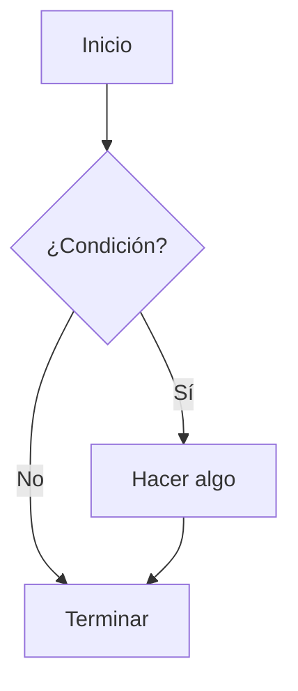

Este es un ejemplo de matemáticas en línea: $E = mc^2$.

Aquí tienes una fórmula en bloque:

$$
\int_a^b f(x) dx = F(b) - F(a)
$$

Y ahora un gráfico Mermaid

 Y ahora alguna gráfica más

 <Chart
  type="line"
  data={[
    { name: 'Enero', uv: 4000, pv: 2400 },
    { name: 'Febrero', uv: 3000, pv: 1398 },
    { name: 'Marzo', uv: 2000, pv: 9800 },
  ]}
  config={[
    { dataKey: 'uv', color: '#8884d8' },
    { dataKey: 'pv', color: '#82ca9d' },
  ]}
/>

Y un gráfico de barras:

<Chart
  type="bar"
  data={[
    { name: 'Lunes', visitas: 30 },
    { name: 'Martes', visitas: 45 },
    { name: 'Miércoles', visitas: 50 },
  ]}
  config={[
    { dataKey: 'visitas', color: '#8884d8' },
  ]}
/>
