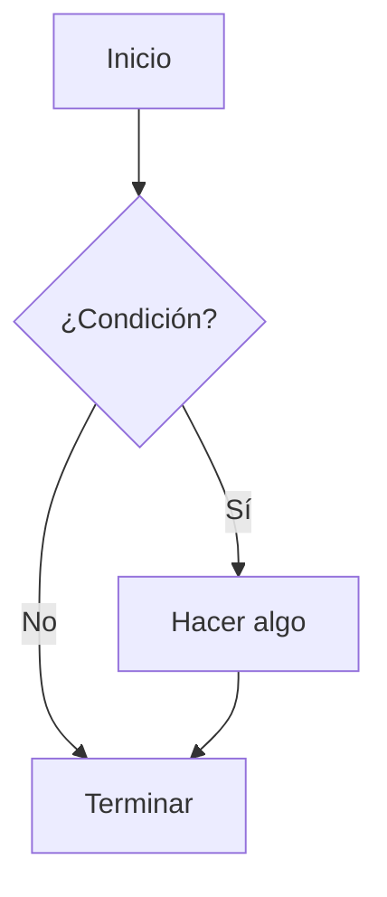

Este es un ejemplo de matemáticas en línea: $E = mc^2$.

Aquí tienes una fórmula en bloque:

$$
\int_a^b f(x) dx = F(b) - F(a)
$$

Y ahora un gráfico Mermaid

```mermaid
graph TD;
  A[Inicio] --> B{¿Condición?};
  B -->|Sí| C[Hacer algo];
  B -->|No| D[Terminar];
  C --> D;
```
